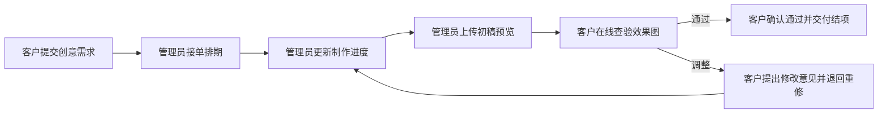

# SparkOne 创意协作中心 (SparkOne Creative Hub)

> 专为 SparkOne 及其外部创意与营销合作团队打造的移动优先项目交付与设计协作平台。

---

## 🌟 产品亮点与核心特性

- **移动优先体验 (Mobile-First)**：现代高端金融科技设计风格（Premium Fintech），纯净留白，以 Spark 经典紫色（`#7C3AED`）点缀，圆角卡片结合大尺寸触控按键。
- **管理员与客户彻底隔离**：
  - **客户（外部业务伙伴）**：默认进入专属客户工作台，无任何内部管理控件或角色切换按钮。支持提报需求、查看制作进度、查验高保真效果图、执行“审核通过”或“提出修改意见”，以及下载物料源文件。
  - **管理员（设计管理团队）**：支持直链访问（`?admin=true`）或点击暗门密码登录（默认密码 `8888`）。具备一键接单排期、实时调整制作进度（`25%`、`50%`、`75%`、`100%`）、上传替换初稿效果图以及项目状态自由流转能力。
- **全站纯中文本地化**：所有编号格式（`项目-1092`）、状态标签、多语言市场徽章、文件分类及提示信息均 100% 汉化。
- **多语言市场适配**：原生支持中文、英语、越南语、印尼语、韩语、日语、泰语 7 大区域语言本地化制作。
- **极简专注**：剔除冗余 CRM、聊天即时通讯、复杂财务或日历负担，专注于创意交接闭环。

---

## 🧭 核心业务流转



---

## 📁 6 大物料归档库

1. **品牌规范** (Brand)
2. **企业物料** (Corporate)
3. **产品界面** (Product)
4. **营销推广** (Marketing)
5. **演示提案** (Presentation)
6. **交付成品** (Final Assets)

---

## 🚀 快速启动

### 依赖安装
```bash
npm install
```

### 本地启动
```bash
npm run dev
```

启动后在浏览器打开：
- 客户视角：`http://localhost:5173/`
- 管理员后台：`http://localhost:5173/?admin=true`（或在页面右上角点击小锁图标输入 `8888`）

### 编译构建
```bash
npm run build
```

### 代码审查
```bash
npm run lint
```
